# List of MicroSims for Claude Skills

Interactive Micro Simulations to help students learn intelligent textbook development fundamentals.

-   **[4-Hour Token Window Visualization](./4-hour-token-window-visualization/index.md)**

    

    Interactive vis-timeline MicroSim for 4-hour token window visualization.

-   **[5-Hour Token Window Visualization](./5-hour-token-window-visualization/index.md)**

    

    Interactive vis-timeline MicroSim for 5-hour token window visualization.

-   **[Adding Taxonomy to CSV Workflow](./adding-taxonomy-workflow/index.md)**

    

    Interactive Mermaid visualization showing adding taxonomy to csv workflow

-   **[Admonition Types Interactive Reference](./admonition-types-interactive-reference/index.md)**

    

    Interactive p5.js MicroSim for admonition types interactive reference.

-   **[Algorithm Visualization with Step Controls MicroSim](./algorithm-visualization-with-step-controls-microsim/index.md)**

    

    Interactive p5.js MicroSim for algorithm visualization with step controls microsim.

-   **[Average Dependencies Distribution Bar Chart](./average-dependencies-distribution/index.md)**

    

    Interactive Chart.js visualization showing average dependencies distribution bar chart

-   **[Basic MicroSim Template Structure](./basic-microsim-template-structure/index.md)**

    

    Interactive p5.js MicroSim for basic microsim template structure.

-   **[Bloom's Taxonomy 1956 vs 2001 Comparison](./bloom-s-taxonomy-1956-vs-2001-comparison/index.md)**

    

    Interactive p5.js MicroSim for bloom's taxonomy 1956 vs 2001 comparison.

-   **[Bloom's Taxonomy Application Distribution in Quality Courses](./bloom-s-taxonomy-application-distribution-in-quality-courses/index.md)**

    

    Interactive Chart.js MicroSim for bloom's taxonomy application distribution in quality courses.

-   **[Bloom's Taxonomy Distribution Analyzer Chart](./bloom-s-taxonomy-distribution-analyzer-chart/index.md)**

    

    Interactive Chart.js MicroSim for bloom's taxonomy distribution analyzer chart.

-   **[Book Build Workflow](./book-build-workflow/index.md)**

    

    Interactive MicroSim for intelligent textbook learning workflows.

-   **[Book Launch Checklist](./book-launch-checklist/index.md)**

    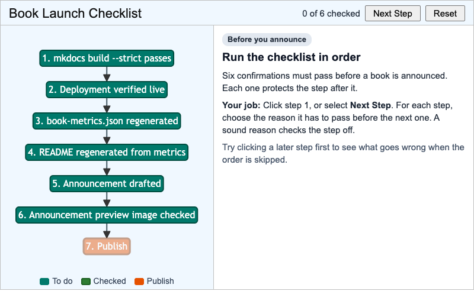

    Work down the launch checklist in order and choose the reason each step must pass before the next.

-   **[Book Levels MicroSim](./book-levels/index.md)**

    

    Interactive p5.js visualization showing the five levels of intelligent textbooks

-   **[Breadboard Tie Points and Animated Current Flow](./breadboard-tie-points-current-flow/index.md)**

    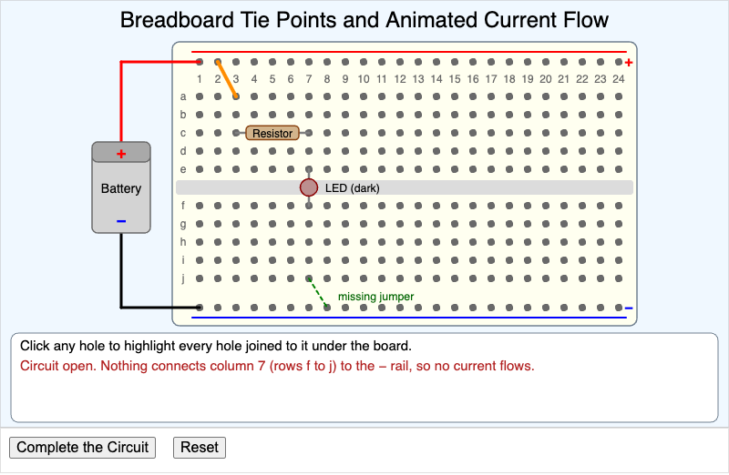

    Click a breadboard hole to see which holes share its strip, then complete an LED circuit and watch the current flow.

-   **[Callout Marker Anatomy](./callout-marker-anatomy/index.md)**

    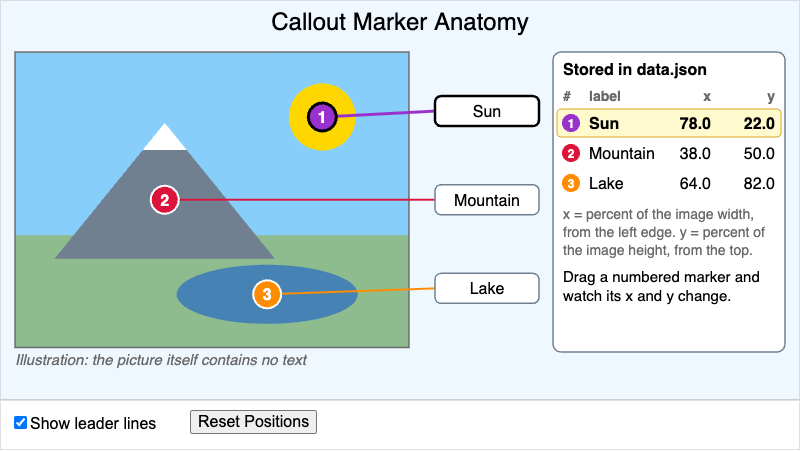

    Drag a numbered marker on a textless illustration and watch its stored x and y coordinate change.

-   **[Certificate of Completion Generator](./certificate-generator/index.md)**

    

    An interactive tool to generate and print professional certificates of completion for course graduates with customizable text and border styles.

-   **[Chapter Content Generation Workflow Timeline](./chapter-content-generation-timeline/index.md)**

    

    Interactive timeline showing the 8 sequential stages of chapter content generation

-   **[Chapter Index File Structure](./chapter-index-structure/index.md)**

    

    Interactive Mermaid visualization showing chapter index file structure

-   **[Chapter Organization Workflow Diagram](./chapter-organization-workflow/index.md)**

    

    Mermaid workflow for chapter content organization decisions with interactive hover details

-   **[Claude Code Memory Layers](./claude-code-memory-layers/index.md)**

    

    An interactive infographic showing the five memory layers in Claude Code, how they load, and how higher-priority rules override lower-priority ones.

-   **[Claude Code T-Shirt Design](./claude-code-tshirt-design/index.md)**

    

    Interactive MicroSim for intelligent textbook learning workflows.

-   **[Claude Code Workflow Diagram](./claude-code-workflow-diagram/index.md)**

    

    Interactive Mermaid MicroSim for claude code workflow diagram.

-   **[Color Accessibility Checker MicroSim](./color-accessibility-checker-microsim/index.md)**

    

    Interactive p5.js MicroSim for color accessibility checker microsim.

-   **[Color Wheel with Named Colors](./color-wheel-with-named-colors/index.md)**

    

    An interactive color wheel displaying web-safe named colors. Hover over any color dot to see the color name, RGB values, and hex code.

-   **[Command-Line Interface Basics Interactive Infographic](./command-line-interface-basics-interactive-infographic/index.md)**

    

    Interactive p5.js MicroSim for command-line interface basics interactive infographic.

-   **[Concept Count by Course Duration](./concept-count-by-course-duration/index.md)**

    

    Interactive Chart.js MicroSim for concept count by course duration.

-   **[Concept Depth Distribution Analysis](./concept-depth-distribution-analysis/index.md)**

    

    Interactive Chart.js MicroSim for concept depth distribution analysis.

-   **[Concept Granularity Spectrum Visualization](./concept-granularity-spectrum-visualization/index.md)**

    

    Interactive p5.js MicroSim for concept granularity spectrum visualization.

-   **[Concept Label Length Histogram](./concept-length-histogram/index.md)**

    

    Interactive Chart.js visualization showing concept label length histogram

-   **[Concept Label Length Optimization](./concept-label-length-optimization/index.md)**

    

    Interactive p5.js MicroSim for concept label length optimization.

-   **[Concept Label Quality Checklist](./concept-label-quality-checklist/index.md)**

    

    Interactive p5.js MicroSim for concept label quality checklist.

-   **[ConceptID vs ConceptLabel Comparison](./conceptid-vs-conceptlabel-comparison/index.md)**

    

    Interactive p5.js MicroSim for conceptid vs conceptlabel comparison.

-   **[Context Window Budget](./context-window-budget/index.md)**

    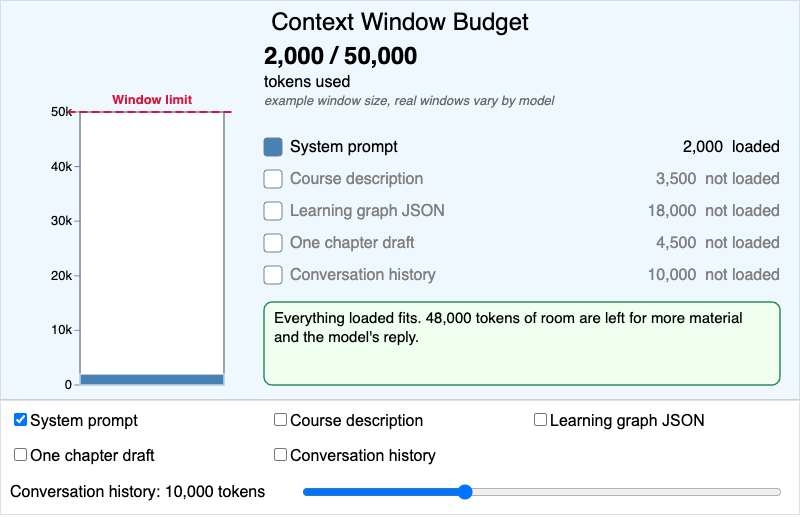

    Check items on and off to spend an example 50,000-token context window and see what happens to content past the limit.

-   **[Course Description Quality Impact on Workflow](./course-description-quality-workflow/index.md)**

    

    Interactive p5.js workflow diagram showing exponential quality impacts

-   **[Course Description Quality Rubric Visualization](./course-description-quality-rubric-visualization/index.md)**

    

    Interactive p5.js MicroSim for course description quality rubric visualization.

-   **[Cover Image Generation Workflow](./cover-image-workflow/index.md)**

    

    Interactive MicroSim for intelligent textbook learning workflows.

-   **[CSV File Format Example with Validation](./csv-file-format-example-with-validation/index.md)**

    

    Interactive p5.js MicroSim for csv file format example with validation.

-   **[CSV to JSON Conversion Mapping Diagram](./csv-to-json-conversion-mapping-diagram/index.md)**

    

    Interactive Mermaid MicroSim for csv to json conversion mapping diagram.

-   **[DAG vs Cyclic Graph Comparison](./dag-vs-cyclic-graph-comparison/index.md)**

    

    Interactive Mermaid MicroSim for dag vs cyclic graph comparison.

-   **[Dependency Mapping Decision Tree](./dependency-mapping-decision-tree/index.md)**

    

    Interactive Mermaid MicroSim for dependency mapping decision tree.

-   **[Dependency Mapping Workflow](./dependency-mapping-workflow/index.md)**

    

    Interactive Mermaid MicroSim for dependency mapping workflow.

-   **[Dependency Pattern Examples](./dependency-pattern-examples/index.md)**

    

    Interactive Mermaid MicroSim for dependency pattern examples.

-   **[Dublin Core Metadata Field Reference Card](./dublin-core-metadata-field-reference-card/index.md)**

    

    Interactive p5.js MicroSim for dublin core metadata field reference card.

-   **[Evolution of AI Approaches Timeline](./evolution-of-ai-approaches-timeline/index.md)**

    

    Interactive vis-timeline MicroSim for evolution of ai approaches timeline.

-   **[Evolution of AI: From Neural Networks to Claude Code](./claude-code-timeline/index.md)**

    

    Interactive HTML/CSS/JavaScript visualization showing evolution of ai: from neural networks to claude code

-   **[FAQ Question Pattern Analysis Workflow](./faq-pattern-analysis/index.md)**

    

    Interactive Mermaid visualization showing faq question pattern analysis workflow

-   **[Five Levels of Textbook Intelligence Visual Model](./five-levels-of-textbook-intelligence-visual-model/index.md)**

    

    Interactive p5.js MicroSim for five levels of textbook intelligence visual model.

-   **[From Hook to Dashboard](./hook-to-dashboard-pipeline/index.md)**

    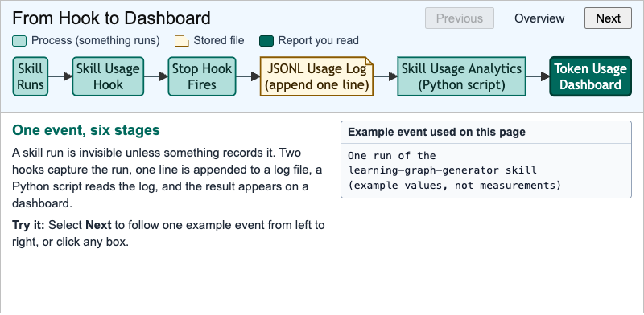

    Follow one skill-run event from a hook, into a JSONL log, and out as a row of a token usage dashboard.

-   **[Git Branching and Merging Visualization MicroSim](./git-branching-and-merging-visualization-microsim/index.md)**

    

    Interactive p5.js MicroSim for git branching and merging visualization microsim.

-   **[Git Workflow for Skill Development](./git-workflow-skill-development/index.md)**

    

    Interactive Mermaid visualization showing git workflow for skill development

-   **[Idempotent Script Simulator](./idempotent-script-simulator/index.md)**

    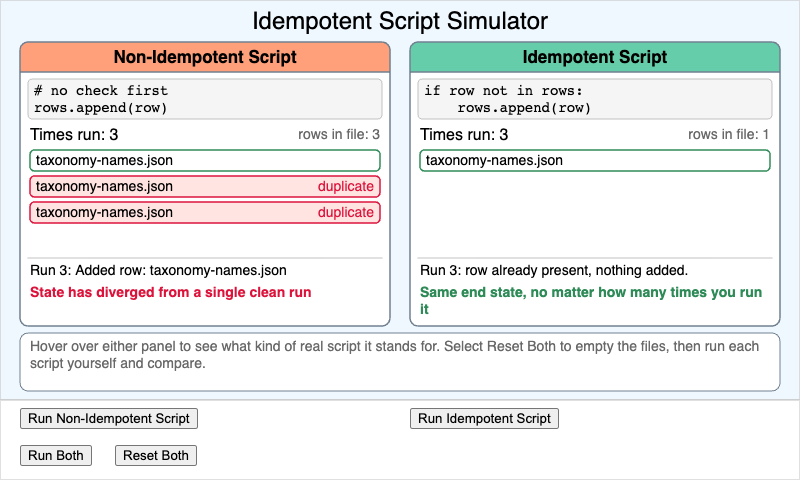

    Run an idempotent script and a non-idempotent script several times and compare the end state of their files.

-   **[Install Book Environment Dependencies](./install-book-env/index.md)**

    

    An interactive dependency graph visualization showing all software components required to set up an intelligent textbook development environment using MkDocs Material and Claude Skills.

-   **[Interactive Directory Navigation Practice MicroSim](./interactive-directory-navigation-practice-microsim/index.md)**

    

    Interactive p5.js MicroSim for interactive directory navigation practice microsim.

-   **[Interactive Exercise Generator MicroSim](./interactive-exercise-generator-microsim/index.md)**

    

    Interactive p5.js MicroSim for interactive exercise generator microsim.

-   **[Interactive Learning Element Types Comparison](./interactive-learning-element-types-comparison/index.md)**

    

    Interactive Chart.js MicroSim for interactive learning element types comparison.

-   **[Interactive Quiz Question Constructor MicroSim](./interactive-quiz-question-constructor-microsim/index.md)**

    

    Interactive p5.js MicroSim for interactive quiz question constructor microsim.

-   **[ISO 11179 Principles Comparison Table Infographic](./iso-11179-principles-comparison-table-infographic/index.md)**

    

    Interactive p5.js MicroSim for iso 11179 principles comparison table infographic.

-   **[Iterative Prompt Refinement Metrics](./iterative-prompt-refinement-metrics/index.md)**

    

    Interactive Chart.js MicroSim for iterative prompt refinement metrics.

-   **[Learning Graph Color Test](./graph-color-test/index.md)**

    

    Interactive MicroSim for intelligent textbook learning workflows.

-   **[Learning Graph JSON Schema](./learning-graph-json-schema/index.md)**

    

    Interactive Mermaid visualization showing learning graph json schema

-   **[Learning Graph Quality Score Calculator MicroSim](./learning-graph-quality-score-calculator-microsim/index.md)**

    

    Interactive p5.js MicroSim for learning graph quality score calculator microsim.

-   **[Learning Graph Structure Visualization](./learning-graph-structure-visualization/index.md)**

    

    Interactive vis-network MicroSim for learning graph structure visualization.

-   **[Learning Graph Viewer](./graph-viewer/index.md)**

    

    Interactive vis-network visualization showing learning graph viewer

-   **[Linear Chain vs Network Structure Comparison](./linear-chain-vs-network/index.md)**

    

    Interactive vis-network visualization showing linear chain vs network structure comparison

-   **[Lower-Order vs Higher-Order Thinking Skills](./lower-order-vs-higher-order-thinking-skills/index.md)**

    

    Interactive p5.js MicroSim for lower-order vs higher-order thinking skills.

-   **[Major World Cities](./test-world-cities/index.md)**

    

    Interactive Leaflet visualization showing major world cities

-   **[Material Theme Features Interactive Comparison](./material-theme-features-interactive-comparison/index.md)**

    

    Interactive p5.js MicroSim for material theme features interactive comparison.

-   **[Meta-Skill Routing Table](./meta-skill-routing-table/index.md)**

    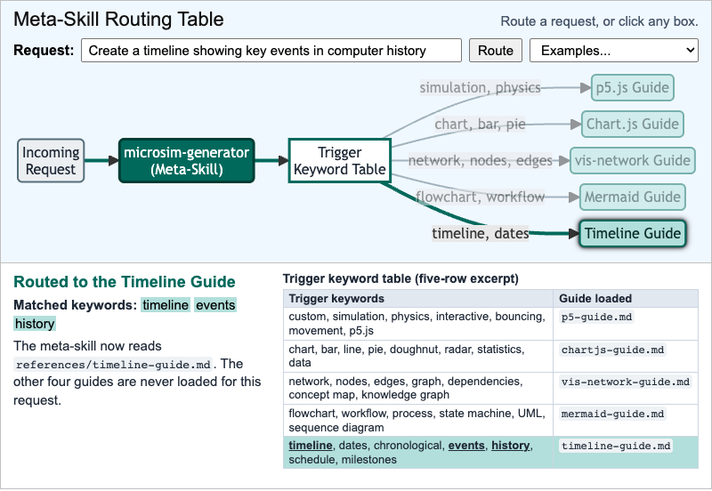

    Type a request and watch a meta-skill match its trigger keywords to exactly one on-demand guide.

-   **[MicroSim Design Quality Checklist](./microsim-design-quality-checklist/index.md)**

    

    Interactive p5.js MicroSim for microsim design quality checklist.

-   **[MicroSim File Relationship Diagram](./microsim-file-relationship-diagram/index.md)**

    

    Interactive p5.js visualization showing microsim file relationship diagram

-   **[MicroSim Library Routing Table](./microsim-library-routing-table/index.md)**

    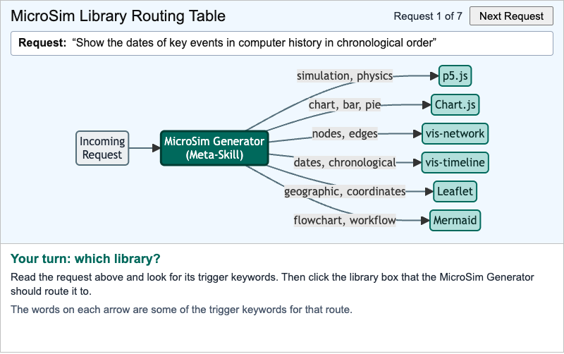

    Read a request, find its trigger keywords, and click the visualization library the MicroSim Generator should route it to.

-   **[MkDocs Build Process Workflow](./mkdocs-build-process/index.md)**

    

    Interactive Mermaid visualization showing mkdocs build process workflow

-   **[MkDocs GitHub Pages Deployment Workflow](./mkdocs-github-pages-deployment/index.md)**

    

    Interactive Mermaid visualization showing mkdocs github pages deployment workflow

-   **[Prompt and Response Flow](./prompt-response-flow/index.md)**

    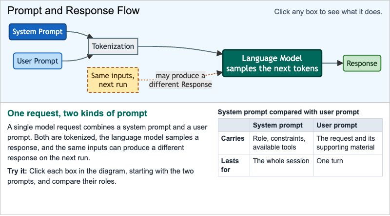

    Clickable flowchart of how a system prompt and a user prompt combine in one request, and why the response can vary.

-   **[Serial Versus Parallel Cost Calculator](./serial-versus-parallel-cost-calculator/index.md)**

    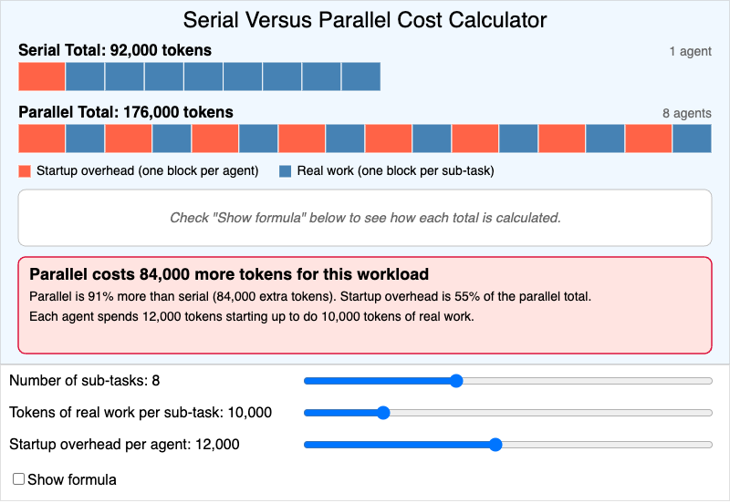

    Calculate the token cost of a task run by one agent versus one agent per sub-task.

-   **[Terminal Nodes Identification Chart](./orphaned-nodes-identification/index.md)**

    

    Interactive Chart.js visualization showing terminal nodes (outdegree=0) identification chart

-   **[p5.js Architecture and Execution Model](./p5js-architecture/index.md)**

    

    Interactive p5.js visualization showing p5.js architecture and execution model

-   **[Permission Bits Visual Infographic](./permission-bits-visual-infographic/index.md)**

    

    Interactive p5.js MicroSim for permission bits visual infographic.

-   **[Prompt Engineering Iterative Refinement Workflow](./prompt-engineering-iterative-refinement-workflow/index.md)**

    

    Interactive Mermaid MicroSim for prompt engineering iterative refinement workflow.

-   **[Pronounce Button and Streaming Playback](./pronounce-button-demo/index.md)**

    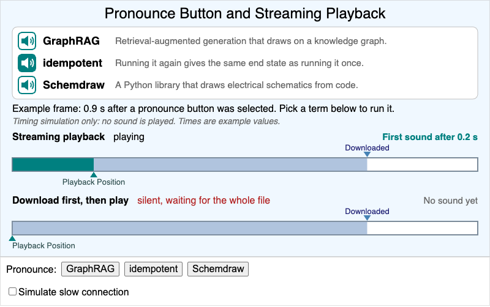

    Select a pronounce button and compare streaming playback with waiting for the whole audio file to download.

-   **[Python Learning Graph Processing Pipeline](./python-learning-graph-processing-pipeline/index.md)**

    

    Interactive p5.js MicroSim for python learning graph processing pipeline.

-   **[Responsive Iframe Embedding MicroSim](./responsive-iframe-embedding-microsim/index.md)**

    

    Interactive p5.js MicroSim for responsive iframe embedding microsim.

-   **[Security Zones Diagram](./security-zones-diagram/index.md)**

    

    Interactive Mermaid visualization showing security zones diagram

-   **[Sine Function Visualization](./sine-function-plot/index.md)**

    

    Interactive plot of the sine function with slider control to explore points along the curve

-   **[Skill Context Window](./skill-context-window/index.md)**

    

    Interactive p5.js visualization of skill context window concept

-   **[Skill Development Priority Matrix Visualization](./skill-impact-chart/index.md)**

    

    Interactive Chart.js visualization showing skill development priority matrix visualization

-   **[Skill Directory Structure](./skill-directory-structure/index.md)**

    

    Interactive Mermaid visualization showing skill directory structure

-   **[Skill File Anatomy Diagram](./skill-file-anatomy-diagram/index.md)**

    

    Interactive p5.js MicroSim for skill file anatomy diagram.

-   **[Skill Installation Locations and Priority](./skill-installation-locations-and-priority/index.md)**

    

    Interactive Mermaid MicroSim for skill installation locations and priority.

-   **[Skill Installation Workflow](./skill-installation-workflow/index.md)**

    

    Interactive HTML/CSS/JavaScript visualization showing skill installation workflow

-   **[Skill Invocation and Execution Lifecycle](./skill-invocation-and-execution-lifecycle/index.md)**

    

    Interactive Mermaid MicroSim for skill invocation and execution lifecycle.

-   **[Skill Package Contents Checklist](./skill-package-contents-checklist/index.md)**

    

    Interactive p5.js MicroSim for skill package contents checklist.

-   **[Skill Permission Matrix](./skill-permission-matrix/index.md)**

    

    Interactive p5.js MicroSim for skill permission matrix.

-   **[Skill Testing Workflow Diagram](./skill-testing-workflow-diagram/index.md)**

    

    Interactive p5.js MicroSim for skill testing workflow diagram.

-   **[Skills vs Commands Decision Tree](./skills-vs-commands-decision-tree/index.md)**

    

    Interactive Mermaid MicroSim for skills vs commands decision tree.

-   **[Taxonomy Distribution Pie Chart](./taxonomy-distribution-pie/index.md)**

    

    Interactive Chart.js visualization showing taxonomy distribution pie chart

-   **[Terminal Workflow for Textbook Development](./terminal-workflow-textbook/index.md)**

    

    Interactive Mermaid visualization showing terminal workflow for textbook development

-   **[Textbook Generation Pipeline](./textbook-generation-pipeline/index.md)**

    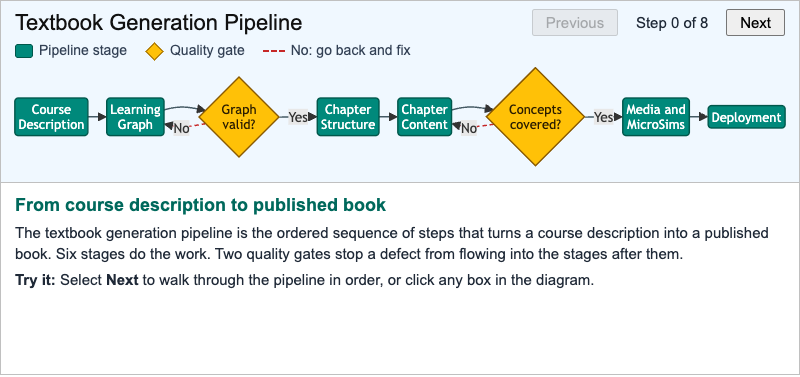

    Step through the stages that turn a course description into a published textbook, including the two quality gates.

-   **[The Eight-Phase Verified Infographic Pipeline](./verified-infographic-pipeline-phases/index.md)**

    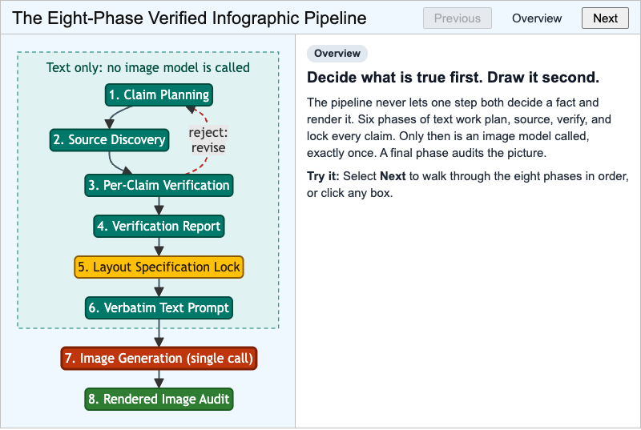

    Step through the eight phases that verify every claim in text before a single image is generated.

-   **[Three-Color DFS Cycle Detection](./three-color-dfs/index.md)**

    

    Interactive vis-network visualization demonstrating the three-color DFS algorithm for detecting cycles in learning graphs

-   **[Token Consumption Timeline for Complete Textbook Project](./token-consumption-timeline-for-complete-textbook-project/index.md)**

    

    Interactive vis-timeline MicroSim for token consumption timeline for complete textbook project.

-   **[Token Waste Reinforcing Loop](./token-waste-reinforcing-loop/index.md)**

    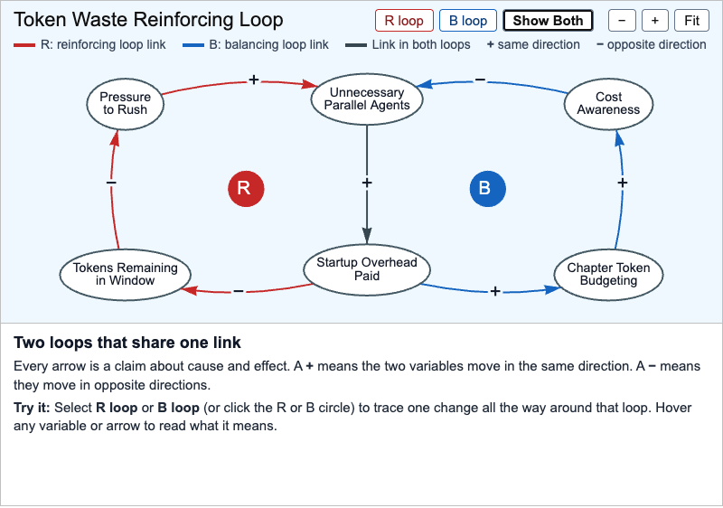

    Trace one change around a reinforcing loop and a balancing loop built from the book's token-waste example.

-   **[Tokenization Visualizer](./tokenization-visualizer/index.md)**

    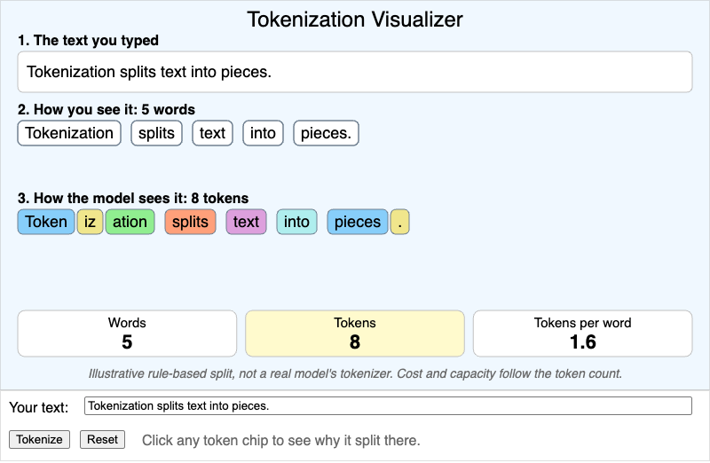

    Type a sentence and compare its word boxes with its token chips, using an illustrative rule-based tokenizer.

-   **[Topic-to-Concept Expansion Example](./topic-to-concept-expansion-example/index.md)**

    

    Interactive vis-network MicroSim for topic-to-concept expansion example.

-   **[Topic-to-Concept Expansion Process](./topic-to-concept-expansion-process/index.md)**

    

    Interactive Mermaid MicroSim for topic-to-concept expansion process.

-   **[Transformer Architecture Diagram](./transformer-architecture-diagram/index.md)**

    

    Interactive Mermaid MicroSim for transformer architecture diagram.

-   **[VS Code Interface Layout for Textbook Development](./vs-code-interface-layout-for-textbook-development/index.md)**

    

    Interactive p5.js MicroSim for vs code interface layout for textbook development.

-   **[Worked Example: Determining Reading Level from Course Description](./worked-example-determining-reading-level-from-course-description/index.md)**

    

    Interactive p5.js MicroSim for worked example: determining reading level from course description.

-   **[xAPI Statement Builder](./xapi-statement-builder/index.md)**

    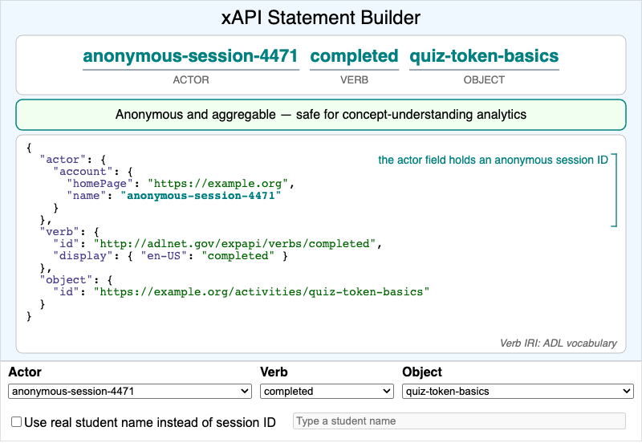

    Build an actor-verb-object xAPI statement and see which field turns it into per-student data.

